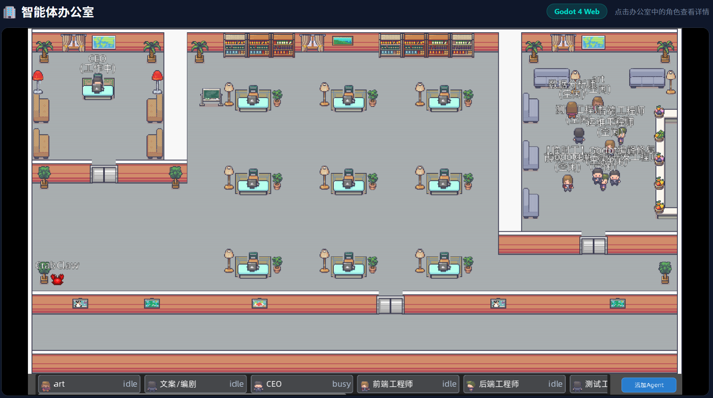

# AICube Dashboard

基于 OpenClaw 的可视化控制台，用于管理 Agent、渠道、插件和技能。内置**智能体办公室**——一个用 Godot 4 构建的 2D 像素风办公室模拟，让 Agent 以角色形象实时呈现在界面上。




## 功能特点

- 🏢 **智能体办公室**：在 Godot 像素风办公室里实时看到每个 Agent 的工作状态（工作中/休息中/移动中），点击角色查看详情
- 🤖 **Agent 管理**：查看、创建、删除 Agent，设置身份标识
- 📊 **机器看板**：实时监控 CPU、内存、磁盘、网络、温度，带历史趋势图表
- 🔌 **插件管理**：查看所有 OpenClaw 插件状态（支持按已加载/已禁用筛选、关键词搜索、分页）
- 🛠️ **技能管理**：查看可用的 Skills
- 💬 **渠道管理**：管理消息渠道（飞书、Telegram 等）
- 💬 **会话管理**：查看和管理 Agent 对话会话
- 📈 **模型管理**：查看配置的语言模型

## 智能体办公室

内置 2D 像素风办公室模拟，Agent 以角色形象实时呈现：

| 角色 | 职位 | 颜色 |
|------|------|------|
| Alice | 前端工程师 | 🔵 蓝 |
| Bob | 后端工程师 | 🩷 粉 |
| Charlie | 设计师 | 🟢 绿 |
| Diana | 测试工程师 | 🟠 橙 |
| Eve | 运维工程师 | 🟣 紫 |

**状态指示：**
- 🟢 **工作中**：在工位上
- 🟠 **休息中**：在休息区
- 🔵 **移动中**：在走廊
- ⚪ **空闲**：等待中

点击任意角色可查看详细信息。办公室场景包含：**老板间**、**员工工位区**、**休息区**。

> ⚠️ **智能体办公室必须在 HTTPS 下运行**（Godot HTML5 导出依赖 SharedArrayBuffer，需要 COOP/COEP 响应头，浏览器仅在安全上下文中启用此特性）。

## 系统要求

- Node.js 18+
- OpenClaw 已安装并配置
- npm 或 pnpm

## 快速开始

### 1. 安装依赖

```bash
cd aicube-dashboard
npm install
```

### 2. 配置文件

复制 `config.example.json` 为 `config.json` 并修改：

```bash
cp config.example.json config.json
```

编辑 `config.json`：

```json
{
  "server": {
    "port": 3000,
    "frontendPort": 5173
  },
  "openclaw": {
    "home": "~/.openclaw",
    "cli": "node",
    "path": ""
  },
  "cors": {
    "origins": ["localhost", "127.0.0.1", "your-domain.com"]
  },
  "auth": {
    "users": {
      "admin": {
        "password": "your-secure-password",
        "name": "管理员"
      }
    }
  }
}
```

### 3. 环境变量（可选，覆盖配置文件）

```bash
export OPENCLAW_HOME=~/.openclaw
export OPENCLAW_CLI=node
export OPENCLAW_PATH=/opt/openclaw/openclaw.mjs
export API_PORT=3000
export CORS_ORIGINS=localhost,127.0.0.1,your-domain.com
export VITE_ALLOWED_HOSTS=your-domain.com
```

### 4. 启动服务

```bash
# 一键启动（API + 前端）
bash start.sh

# 或分别启动
node server/index.cjs &    # API 服务 (3000)
npm run dev:vite           # 前端开发服务器 (5173)
```

### 5. 访问

- 前端：http://localhost:5173（或你的域名）
- API：http://localhost:3000/api
- API 文档：http://localhost:3000/

## 目录结构

```
aicube-dashboard/
├── server/              # Express API 服务
│   ├── index.cjs       # API 主文件
│   ├── db/             # SQLite 数据库
│   └── data/           # 用户数据（API Key、用户配置）
├── src/                # Vue 3 前端源码
│   └── views/          # 页面组件
├── public/             # 静态资源
│   └── office/         # Godot 智能体办公室（HTML5 导出）
├── dist/               # 构建产物
├── start.sh            # 自动重启脚本
├── vite.config.js      # Vite 配置
└── package.json
```

## 登录账号配置

### 首次设置

本系统**不包含任何内置默认账号**，以确保安全。

**方式一（推荐）：部署前配置**

在 `config.json` 中配置用户：

```json
{
  "auth": {
    "users": {
      "admin": {
        "password": "your-secure-password",
        "name": "管理员"
      }
    }
  }
}
```

**方式二：首次启动后查看自动生成的随机密码**

如果部署时未在 `config.json` 中配置任何用户，系统会在首次启动时：
1. 自动生成一个随机密码
2. 将其写入 `server/data/users.json`
3. 在控制台打印出来（请及时记录）

```
⚠️ 未检测到用户配置，已自动生成随机密码（请尽快修改 config.json）：
   用户名: admin  密码: xk92m3qp
```

### 添加/修改/删除用户

直接编辑 `config.json` 中的 `auth.users` 字段即可，保存后重启服务生效：

```json
{
  "auth": {
    "users": {
      "admin": {
        "password": "new-secure-password",
        "name": "管理员"
      },
      "operator": {
        "password": "another-password",
        "name": "运维人员"
      }
    }
  }
}
```

> ⚠️ **生产环境请务必设置强密码**，不要使用简单组合。

## 端口说明

| 服务 | 端口 | 说明 |
|------|------|------|
| API 服务 | 3000 | 后端接口，内部使用 |
| 前端 | 5173 | Vite 开发服务器（HTTPS） |

## API 接口

所有接口可通过 `http://localhost:3000/api` 访问：

| 方法 | 路径 | 说明 |
|------|------|------|
| GET | /api/health | 健康检查 |
| GET | /api/system/stats | 系统性能数据（CPU、内存、磁盘、温度、网络） |
| GET | /api/agents | Agent 列表 |
| GET | /api/agents/status | Agent 实时状态 |
| POST | /api/agents | 创建 Agent |
| DELETE | /api/agents/:id | 删除 Agent |
| GET | /api/sessions | 所有会话 |
| GET | /api/sessions/:agentId | 指定 Agent 的会话 |
| GET | /api/models | 模型列表 |
| GET | /api/channels | 渠道列表 |
| GET | /api/channels/status | 渠道状态 |
| GET | /api/skills | 技能列表 |
| GET | /api/plugins | 插件列表 |

## 认证

大多数接口需要 Bearer Token 认证：

```
Authorization: Bearer your-api-key
```

API Key 可在首次启动后从 `server/data/api_key.txt` 获取，或通过 `/api/key` 接口获取。

## 自动重启

`start.sh` 脚本会在服务崩溃后自动重启，也可以设置开机自启：

```bash
# 添加开机自启
(crontab -l 2>/dev/null; echo "@reboot cd /path/to/aicube-dashboard && bash start.sh > /tmp/aicube.log 2>&1 &") | crontab -
```

## 部署到生产环境

1. 构建前端：`npm run build`
2. 使用 Nginx 反向代理到 5173 端口
3. 配置 HTTPS
4. 使用 systemd 或 PM2 管理进程

## 开源协议

MIT License
